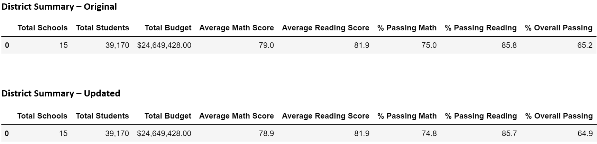
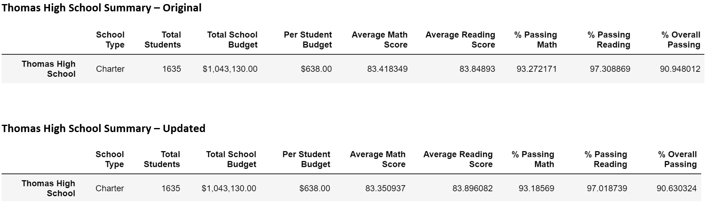
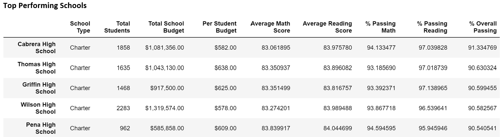
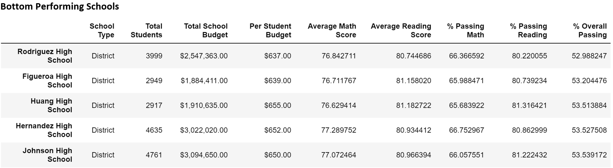
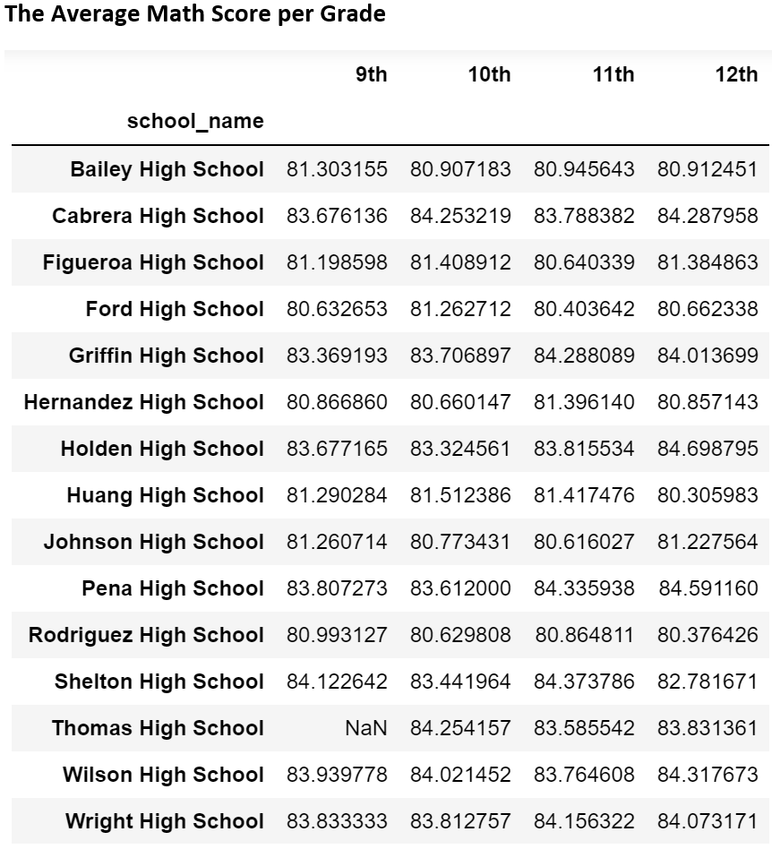
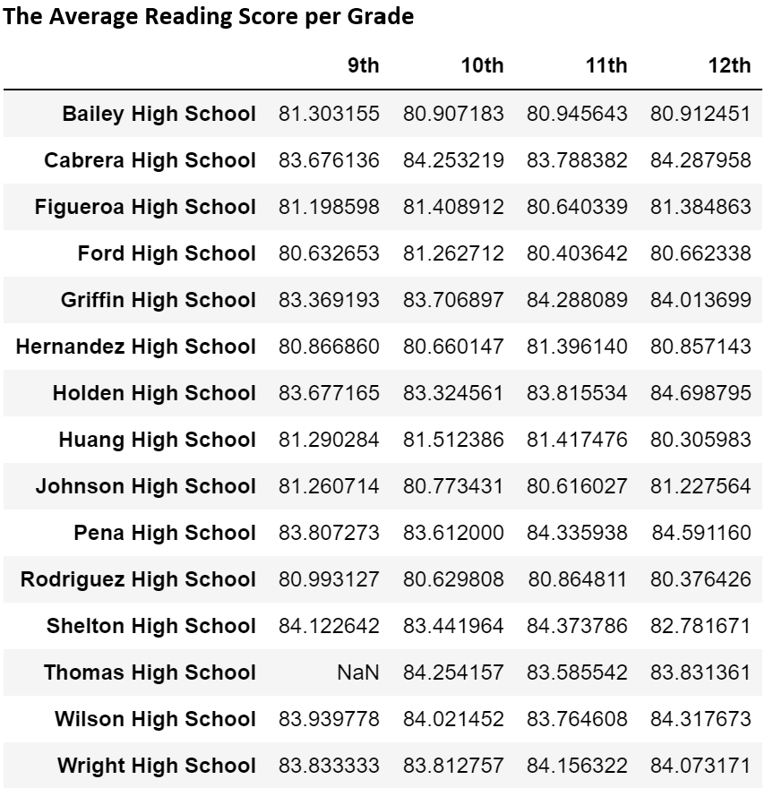
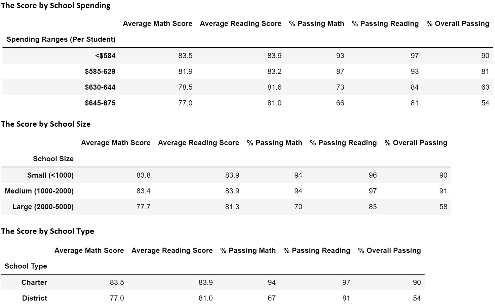

# School_District_Analysis

## Overview of the Analysis
This project corrects the school district analysis by removing Thomas High School ninth grade due to inaccurate grading. It provides an updated result on the analysis and allow users to make decision based on the correct dataset. 

The result is shown as below:
- District summary;
- School summary;
- Top performing and Bottom performing shcool;
- Average math score and Average reading score for all grades;
- The score grouped by school spending, school size, and school type

## Results

### Impact on District Summary
From the original and updated District Summary below, we can get the following impact:

- Average math score decreased from 79 to 78.9;
- Average reading score has no change;
- Percentage of passing math decreased from 75% to 74.8%;
- Percentage of passing reading decreased from 85.8% to 85.7%;
- Overall passing percentage decreased from 65.2% to 64.9%

### Impact on School Summary
From the original and updated School Summary below, we can see there's a slight change in average scores and passing rates by not counting ninth grade students:

- Average math score decreased from 83.42 to 83.35;
- Average reading score increased from 83.85 to 83.9;
- Percentage of passing math decreased from 93.3% to 93.2%;
- Percentage of passing reading decreased from 97.3% to 97.0%;
- Overall passing percentage decreased from 90.9% to 90.6%

### Impact on Thomas High School Performance
By having an overall passing score at 90.6%, Thomas High School is ranked as the second top performance school. 

Below is also the bottom performing schools based on the overall passing score:

### Impact on School Summary
- By removing ninth grade from Thomas High School, the average math score and average reading score for Thomas High School is now shown as NaN;

- There is no change on the score by school spending;
- There is no change on the score by school size;
- There is no change on the score by school type

## Summary
By replacing ninth grade from Thomas High School, the impact is summarized as the following:
- the district summary had a decrease in average math score, percentage of passing math, percentage of passing reading, and overall passing percentage;
- the school summary had a decrease in average math score, percentage of passing math, percentage of passing reading, and overall passing percentage;
- There is no change in shcool ranking but Thomas High School's ranking is further away from Cabrera High School since its overall passing percentage decreased;
- the average grade per school no longer has data available for Thomas High School
